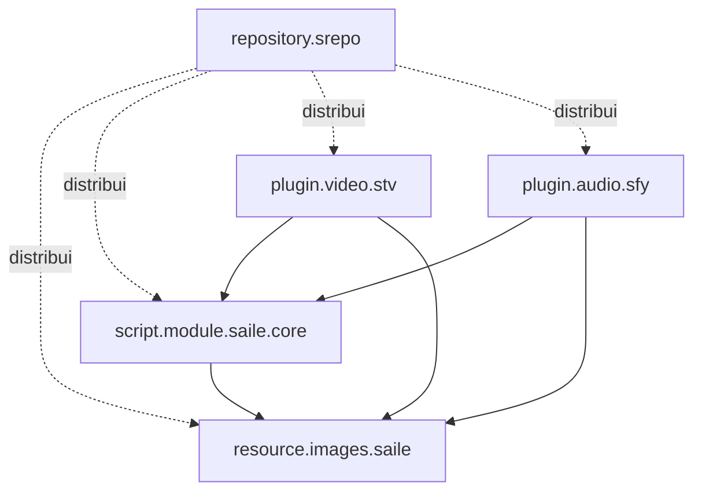

# Blueprint do repositório

```text
saile-repo-dev/
├── .agents/skills/                      # instruções; nunca produção
├── .github/workflows/
├── addons/
│   ├── repository.srepo/
│   ├── resource.images.saile/
│   │   └── resources/media/
│   │       ├── common/
│   │       ├── sfy/
│   │       └── stv/
│   ├── script.module.saile.core/
│   │   └── lib/saile_core/
│   ├── plugin.video.stv/
│   │   └── resources/lib/stv/
│   └── plugin.audio.sfy/
│       └── resources/lib/sfy/
├── artwork/generic/                     # fontes temporárias para bootstrap
├── documentation/
├── schemas/
├── tests/
├── tools/
├── site/                                # gerado pelo build
├── .env.example
├── .gitignore
├── AGENTS.md
└── README.md
```

## Grafo de dependências



Não existem dependências de sTv para sFy, nem de sFy para sTv.

## Conteúdo permitido no core

- caminhos portáveis;
- artwork compartilhado;
- notificações;
- erros padronizados;
- logging sanitizado;
- helpers HTTP/JSON genéricos;
- capacidades do dispositivo;
- utilitários SQLite sem schema de domínio.

## Conteúdo proibido no core

- endpoints Xtream;
- matching TMDB;
- categorias de TV, filmes ou séries;
- busca musical e playlists;
- seleção de formatos yt-dlp;
- rotas específicas das homes.

## Add-ons futuros condicionais

```text
script.module.saile.ytdlp   após prova técnica multiplataforma
service.saile.monitor       após necessidade funcional comprovada
repository.srepo.beta       após existir processo de release estável
```
