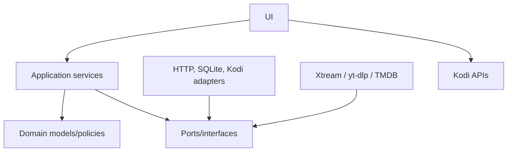

# Blueprint do repositório

```text
srepo/
├── .agents/
│   └── skills/                         # instruções do agente, nunca produção
├── .github/
│   └── workflows/
├── addons/
│   ├── repository.srepo/
│   │   ├── addon.xml
│   │   ├── icon.png
│   │   └── fanart.jpg
│   ├── plugin.video.stv/
│   │   ├── addon.xml
│   │   ├── default.py
│   │   ├── icon.png
│   │   ├── fanart.jpg
│   │   └── resources/
│   │       ├── settings.xml
│   │       ├── language/
│   │       ├── media/
│   │       └── lib/
│   │           ├── app/
│   │           ├── domain/
│   │           ├── infrastructure/
│   │           ├── providers/xtream/
│   │           ├── metadata/tmdb/
│   │           ├── persistence/
│   │           └── ui/
│   └── plugin.audio.sfy/
│       ├── addon.xml
│       ├── default.py
│       ├── icon.png
│       ├── fanart.jpg
│       └── resources/
│           ├── settings.xml
│           ├── language/
│           ├── media/
│           └── lib/
│               ├── app/
│               ├── domain/
│               ├── infrastructure/
│               ├── providers/ytdlp/
│               ├── persistence/
│               └── ui/
├── artwork/
│   ├── artwork-manifest.json           # mapa de cópia dos assets temporários
│   └── generic/
│       ├── repository.srepo/
│       ├── plugin.video.stv/
│       │   └── resources/media/
│       └── plugin.audio.sfy/
│           └── resources/media/
├── docs/
├── schemas/
├── tests/
│   ├── stv/
│   ├── sfy/
│   ├── repository/
│   └── fixtures/
├── tools/
│   ├── build_repo.py
│   ├── validate_addons.py
│   ├── validate_zips.py
│   └── secret_scan.py
├── dist/                               # gerado; ignorado ou publicado por workflow
│   ├── repository.srepo/
│   ├── plugin.video.stv/
│   ├── plugin.audio.sfy/
│   ├── addons.xml
│   ├── addons.xml.md5
│   └── SHA256SUMS
├── site/                               # raiz estática do GitHub Pages
│   ├── .nojekyll
│   ├── index.html
│   └── zips/
├── .env.example
├── .gitignore
├── AGENTS.md
└── README.md
```

## Regra de dependência



Domínio não importa `xbmc`, `xbmcgui`, `xbmcplugin`, `sqlite3`, `urllib` ou `yt_dlp`. Isso permite testes fora do Kodi. A camada de infraestrutura implementa portas simples e traduz erros externos para exceções do projeto.

## Bootstrap de artwork

Ao criar `addons/repository.srepo`, `addons/plugin.video.stv` ou `addons/plugin.audio.sfy`, o agente deve ler `artwork/artwork-manifest.json` e copiar os assets genéricos para os destinos declarados. O runtime nunca aponta para `artwork/generic/`; essa pasta é uma fonte de scaffolding e documentação.

Regras:

- `icon.png` e `fanart.jpg` são obrigatórios nos três add-ons;
- os ícones internos ficam em `resources/media/`;
- sTv possui fallbacks de pôster e fanart;
- sFy possui fallbacks de álbum, artista e fanart;
- a ausência de um asset obrigatório interrompe o build;
- a arte final pode substituir o arquivo genérico sem alterar a arquitetura.
