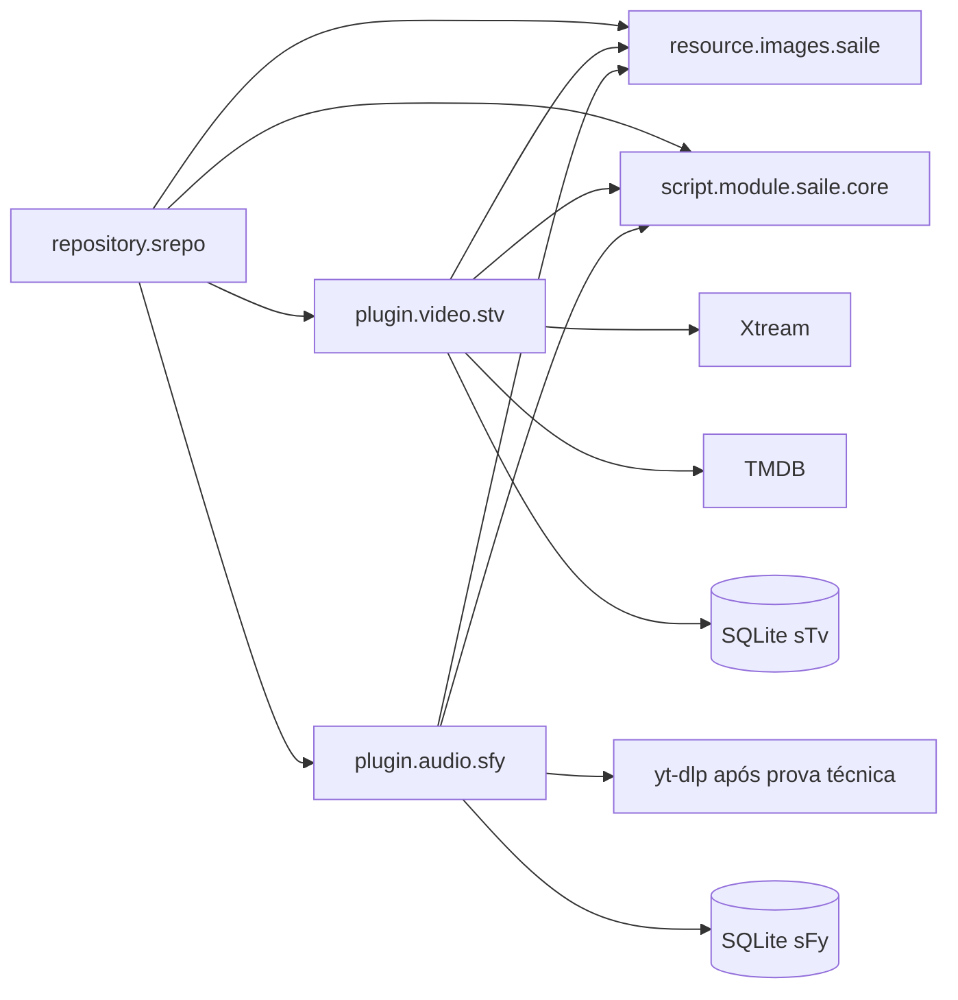

# Arquitetura derivada do roadmap

## Visão



## Navegação sTv

```text
sTv
├── TV ao Vivo
│   ├── Buscar
│   ├── Favoritos
│   └── categorias/canais dinâmicos
├── VOD
│   ├── Buscar
│   ├── Favoritos
│   └── categorias/filmes dinâmicos
├── Séries
│   ├── Buscar
│   ├── Favoritos
│   └── categorias/séries dinâmicas
└── Sincronizar Dados
```

## Navegação sFy

```text
sFy
├── Buscar
├── Minhas Playlists
├── Sincronizar Dados
└── resultados e conteúdo dinâmico
```

## Fluxo sTv

1. Usuário configura host, usuário e senha Xtream no Kodi.
2. Cliente valida autenticação e normaliza payloads.
3. Sincronização manual do catálogo executa UPSERT em SQLite.
4. Home e categorias navegam prioritariamente pelo cache local.
5. Buscar e Favoritos aparecem sempre antes do conteúdo de cada seção.
6. URL de reprodução é construída no último momento.
7. TMDB enriquece VOD/séries, sem fornecer mídia.

## Fluxo sFy

1. A home sempre começa por Buscar, Minhas Playlists e Sincronizar Dados.
2. Resultados de busca exibem thumbnails dinâmicos da fonte.
3. O yt-dlp resolve a URL temporária apenas no momento da reprodução.
4. URLs temporárias não são persistidas.
5. Playlists, faixas conhecidas e histórico ficam no SQLite do perfil.
6. O módulo yt-dlp separado só será criado depois da prova técnica em dispositivos reais.

## Artwork

`resource.images.saile` contém exatamente nove artes fixas de menu/pop-up. Cada add-on mantém sua identidade (`icon.png` e `fanart.jpg`). Capas e fanarts de conteúdo continuam dinâmicas, fornecidas por Xtream, TMDB ou fonte musical e cacheadas pelo Kodi.

## Sincronização LAN

O item `Sincronizar Dados` existe nas duas homes, mas a operação é sempre explícita. A implementação troca registros versionados e sanitizados entre dispositivos na mesma rede; não compartilha `.db` e não sincroniza catálogo, cache ou segredos.

## Fases

1. Módulos compartilhados, contratos de navegação e build.
2. MVP sTv: autenticação, catálogo e reprodução.
3. Favoritos, busca, TMDB e migrações do sTv.
4. Prova técnica yt-dlp multiplataforma.
5. MVP sFy: busca, resolução, playlists e reprodução.
6. Sincronização LAN manual.
7. Recursos futuros: serviço, beta channel e PVR avançado.
