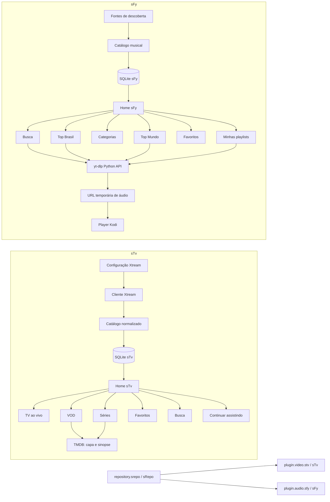

# Arquitetura derivada do roadmap

## Visão geral

## Tradução dos blocos do desenho

| Bloco do roadmap | Responsável | Implementação arquitetural |
|---|---|---|
| provedor/login/senha | sTv | `resources/settings.xml` + serviço de configuração; nunca `.env` runtime |
| dados Xtream | sTv | cliente HTTP isolado e adaptadores de payload |
| conteúdo sTv | sTv | modelos normalizados + SQLite |
| canais/filmes/séries indexados | sTv | tabelas de catálogo e geração de sincronização |
| favoritos | sTv | tabelas de estado do usuário independentes do catálogo |
| continuar assistindo | sTv | tabela de progresso de VOD/episódio |
| séries / TV ao vivo / VOD | sTv | rotas, serviços e renderizadores distintos |
| top Brasil / top mundo / categorias | sFy | fontes de descoberta cacheadas e configuráveis |
| minhas playlists | sFy | playlists locais com referências de faixa |
| capas, álbuns, singles, metadata | sFy | metadata normalizada e artwork cacheado |
| yt-dlp | sFy | resolvedor de busca/formato/URL temporária, sem UI |
| SQLite sincroniza rede local | ambos | fase posterior; export/sync manual por addon, nunca arquivo SQLite compartilhado |
| sRepo | repositório | build, índice, checksum, GitHub Pages e atualizações |
| ícones, fanarts e capas fallback | todos | assets locais genéricos em `artwork/generic/`, copiados para cada add-on e substituíveis depois |

## Fluxo sTv

1. O usuário configura um provedor Xtream no settings do sTv.
2. O serviço valida o host e autenticação.
3. A sincronização baixa categorias e catálogos em etapas.
4. O SQLite recebe UPSERTs e preserva favoritos/progresso.
5. A UI navega principalmente no cache local.
6. Na reprodução, a URL Xtream é construída/resolvida no último momento.
7. Para VOD e séries, TMDB pode enriquecer artwork e sinopse sem alterar a identidade do item.

## Fluxo sFy

1. A home lê charts, categorias, playlists e favoritos do cache/local.
2. A busca produz candidatos normalizados.
3. Ao escolher uma faixa, o serviço usa `yt_dlp.YoutubeDL.extract_info`.
4. O seletor escolhe um formato de áudio compatível.
5. A URL temporária é entregue ao player Kodi.
6. Somente IDs e metadata são persistidos; a URL temporária expira e é resolvida novamente.

## Sincronização LAN

O desenho original inclui sincronização SQLite em rede local. Para evitar corrupção e acoplamento, a implementação correta não compartilha o arquivo `.db` por SMB nem abre o mesmo banco a partir de dispositivos diferentes. A fase futura deve usar uma operação manual acionada pelo usuário, trocar registros serializados, aplicar resolução de conflitos e manter um banco independente por dispositivo e addon.

## Fluxo de artwork e fallback

1. O scaffolding copia os assets descritos em `artwork/artwork-manifest.json`.
2. O add-on sempre possui `icon.png` e `fanart.jpg` locais.
3. A UI tenta artwork específico do item, validado e cacheado.
4. sTv usa TMDB ou Xtream quando disponível e recorre ao pôster/fanart genérico quando necessário.
5. sFy usa metadata da fonte quando disponível e recorre às capas genéricas de álbum, artista e fanart.
6. A substituição visual futura mantém os nomes dos arquivos ou atualiza todas as referências e testes.

O catálogo completo está em `docs/ui/ARTWORK_CATALOG.md`.
